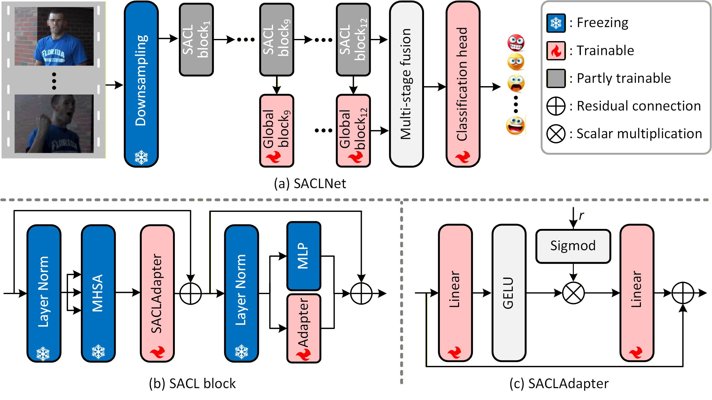

\# SACLNet: Spatial affective-context learning network for emotion recognition from user-generated videos

In this work, we propose a spatial affective-context learning network for emotion recognition from user-generated videos. The framework of this method is shown as below.

